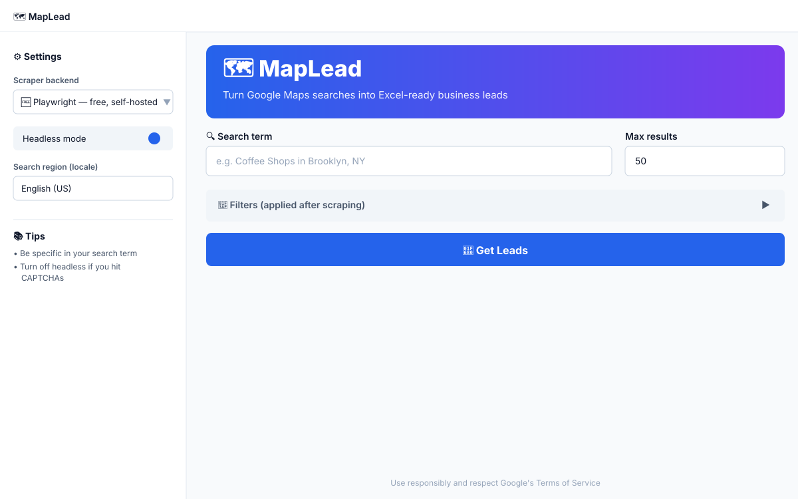
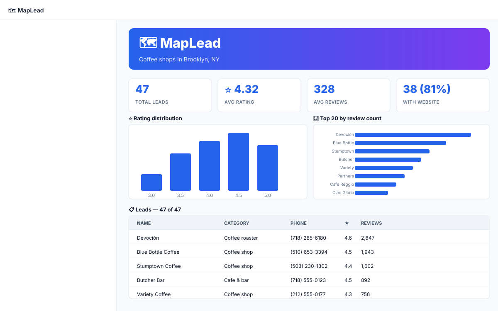

# 🗺️ MapLead

> Turn Google Maps searches into Excel-ready business leads. Free, self-hosted, deploy in 30 seconds.

<p align="center">
  
</p>

<p align="center">
  <a href="#-features">Features</a> ·
  <a href="#-quick-start">Quick start</a> ·
  <a href="#%EF%B8%8F-deploy-to-streamlit-cloud">Deploy</a> ·
  <a href="#-docker">Docker</a> ·
  <a href="#-scraper-backends">Backends</a> ·
  <a href="#-api">API</a>
</p>

---

## 📸 Screenshots

<p align="center">
  
  
</p>
<p align="center">
  
</p>

---

## ✨ Features

| | |
|---|---|
| 🎯 **Any Google Maps query** | "Plumbers in Austin", "yoga studios in Brooklyn", … |
| 🌍 **11 locales** | en, de, fr, es, it, pt-BR, ja, ko, zh-CN, ar — parses `4,5` / `4.5` / `4・5` correctly |
| 🔌 **3 scraper backends** | Playwright (free) · Outscraper (paid, robust) · SerpApi (paid, robust) |
| 📊 **Live dashboard** | Total leads, avg rating, avg reviews, % with website/phone |
| 📈 **Charts** | Rating distribution · top reviewers |
| 🎯 **Filters** | Min rating, min reviews, must-have website, must-have phone |
| 📥 **Multi-format export** | Excel (`.xlsx`), CSV, JSON — streamed in-browser |
| 🛡️ **Stealth mode** | Randomized UAs, hidden `navigator.webdriver`, humanized scroll/click |
| 🔁 **Retry logic** | Exponential backoff on network failures |
| 🐳 **Docker-ready** | Multi-stage build, non-root user, healthcheck included |
| ✅ **CI tested** | GitHub Actions runs 15 smoke tests across Python 3.10/3.11/3.12 |

---

## 🚀 Quick start

### Option A — Local Python

```bash
git clone https://github.com/sabsar42/Google-Map-Scrapper-Streamlit-Web.git
cd Google-Map-Scrapper-Streamlit-Web
python -m venv .venv
# Windows
.venv\Scripts\activate
# macOS / Linux
source .venv/bin/activate

pip install -r requirements.txt
playwright install chromium
streamlit run app.py
```

Opens at **http://localhost:8501**.

### Option B — Docker

```bash
cp .env.example .env       # edit if you have API keys
docker compose up --build
```

### Option C — One-click deploy to Streamlit Cloud

1. Fork this repo.
2. Go to [share.streamlit.io](https://share.streamlit.io) → **New app** → select your fork.
3. **Main file path**: `app.py` → **Deploy**.

---

## 🔌 Scraper backends

Switch via the sidebar dropdown, or set `SCRAPER_BACKEND` in your environment.

| Backend | Cost | Reliability | Setup |
|---|---|---|---|
| **Playwright** | Free | ⚠️ Can hit CAPTCHAs | `playwright install chromium` |
| **Outscraper** | ~$1 / 1k records | ✅ Robust, no proxy needed | Sign up → set `OUTSCRAPER_API_KEY` |
| **SerpApi** | $50/mo for 5k | ✅ Robust, no proxy needed | Sign up → set `SERPAPI_API_KEY` |

Outscraper has a free tier (~100 records/month, no credit card) — perfect for trying it out:
https://app.outscraper.com/profile

---

## 🗂️ Project structure

```
maplead/
├── app.py                 # Streamlit UI (entrypoint)
├── scraper.py             # Playwright scraping engine
├── api_backends.py        # Outscraper & SerpApi adapters
├── utils.py               # Stats + multi-format exporters
├── tests/
│   └── test_smoke.py      # 15 unit tests (no network/browser needed)
├── .github/
│   └── workflows/
│       └── test.yml       # CI: tests + lint + docker build
├── .streamlit/
│   └── config.toml        # Theme
├── docs/
│   ├── banner.svg
│   └── screenshots/       # README screenshots
├── Dockerfile             # Multi-stage container build
├── docker-compose.yml     # Local dev with .env
├── pyproject.toml         # Ruff + pytest config
├── requirements.txt
├── packages.txt           # System libs for Streamlit Cloud
├── .env.example
├── .gitignore
├── .dockerignore
├── LICENSE                # MIT
└── README.md
```

---

## 🧠 How it works

1. **`scraper.py`** launches headless Chromium, navigates to Google Maps, types the query, scrolls the results panel with randomized delays until enough listings load, then clicks each listing and extracts structured data from the side panel.
2. **`api_backends.py`** swaps in a paid API when `SCRAPER_BACKEND` is set — same `BusinessList` output, no UI changes.
3. **Locale-aware parsing** (`parse_rating`, `parse_review_count`) handles decimal/thousands separators across regions.
4. **Selector fallbacks** in `scraper.SELECTORS` try multiple CSS selectors per field — Google rotates them periodically.
5. **`utils.compute_stats()`** derives headline metrics; **`export_excel/csv/json`** serialize to bytes for `st.download_button`.

---

## ⚙️ Configuration

All user-facing settings live in the sidebar. Programmatic options via env vars:

| Variable | Default | Purpose |
|---|---|---|
| `SCRAPER_BACKEND` | `playwright` | `playwright` / `outscraper` / `serpapi` |
| `OUTSCRAPER_API_KEY` | — | Required if backend = outscraper |
| `SERPAPI_API_KEY` | — | Required if backend = serpapi |
| `MAPLEAD_LOCALE` | `en` | UI default locale |

See [`.env.example`](.env.example) for a template.

---

## 🛠️ Troubleshooting

| Symptom | Fix |
|---|---|
| `playwright install` fails | `pip install --upgrade pip` first |
| Blank results | Turn off **headless mode** in the sidebar |
| CAPTCHA appears | Reduce batch size, wait a minute, switch to **Outscraper** |
| `apt-get` errors on Windows | Use **WSL**, **Docker**, or run on macOS / Linux |
| Browser doesn't close | Add `--no-sandbox` (already set) or run inside Docker |
| Streamlit Cloud app crashes | Check **Manage app → Logs** — usually Playwright system libs are missing; `packages.txt` should fix it |

---

## 🧪 Development

```bash
# Run smoke tests
python tests/test_smoke.py

# Or with pytest
pip install pytest
pytest tests/ -v

# Lint
pip install ruff
ruff check .

# Build & test Docker locally
docker build -t maplead:test .
docker run -d --name maplead -p 8501:8501 maplead:test
curl --fail http://localhost:8501/_stcore/health
docker stop maplead
```

CI runs on every push / PR via [.github/workflows/test.yml](.github/workflows/test.yml):
- ✅ Smoke tests on Python 3.10, 3.11, 3.12
- ✅ Ruff lint
- ✅ Docker build sanity check

---

## ⚖️ Legal & ethical use

- Respect Google's [Maps Terms of Service](https://www.google.com/intl/en/help/terms_maps/).
- Don't hammer the endpoint — keep batches ≤100, add 1-2 min between runs.
- For commercial / high-volume use, use an official API (Google Places API) or a licensed third-party (Outscraper, SerpApi, Apify).
- This project is for educational and personal lead-generation purposes. The authors are not responsible for misuse.

---

## 📜 License

MIT — see [LICENSE](LICENSE).

## 🙌 Credits

Built on top of the original [Google-Map-Scrapper-Streamlit-Web](https://github.com/sabsar42/Google-Map-Scrapper-Streamlit-Web) by Shakib Asbar — rewritten and modernized.
